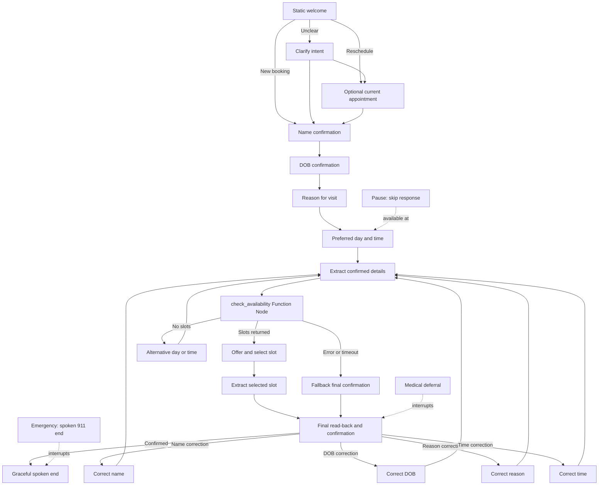

# iClinic Cardiology Front Desk — Retell Take-home

**Agent ID:** `agent_ad4309e2c4d556435a1824abf3`  
**Conversation Flow ID:** `conversation_flow_4d6c383eb204`  
**Active model:** `gpt-4.1-mini` (cascading)

## What this agent does

This Retell voice agent acts as a cardiology clinic front desk for booking and rescheduling requests. It collects and confirms the caller's name, date of birth, reason for visit, and preferred day/time. It does not diagnose, give medical advice, or claim that an appointment is booked.

## Architecture decision: Conversation Flow in rigid mode

I chose Retell Conversation Flow in rigid mode instead of a single large prompt. The assignment is primarily an edge-case and safety evaluation: explicit nodes make emergency termination, field confirmation, correction routing, retry limits, and tool-failure fallbacks predictable and inspectable. Conversation Nodes remain multi-turn, so the design avoids a separate node for every sentence.

```text
Static welcome
  ├─ New booking → name
  ├─ Reschedule → optional current appointment context → name
  └─ Unclear → intent clarification

Name confirmation → DOB confirmation → reason → preferred day/time
  → extract final values → availability Worker
  ├─ slots returned → offer/select a slot → final read-back
  ├─ no slots → collect an alternative preference → re-check
  └─ error/timeout → staff follow-up message → final read-back

Final read-back
  ├─ confirmed → graceful close → end
  └─ correction → correct only that field → re-extract → continue
```



Three global nodes can interrupt any normal node:

- **Emergency hard stop:** uses semantic/contextual detection for an active potentially life-threatening emergency or acute distress, not exact keyword matching. This covers current chest pressure/tightness, breathing difficulty, fainting, stroke-like symptoms, severe sudden symptoms, self-harm/immediate safety risk, and a severe active panic attack with breathing or safety concern. Historical/resolved symptoms and general medical questions do not trigger this path. The global emergency node speaks the 911 instruction and immediately invokes Retell's explicit `end_call` tool in the same turn; it cannot wait for silence, continue booking, or return to another node.
- **Medical-question deferral:** medical, symptom, medication, diagnosis, or treatment questions receive: “I can't answer that but our clinical staff will be happy to discuss it during your visit.” The flow then returns to the prior intake step.
- **Pause handling:** “Hold on,” “give me a second,” and calendar-check requests receive no spoken interruption and return to the prior node.

## Intake and verification decisions

Each required field owns its own multi-turn Conversation Node:

| Field | Design decision | Why |
|---|---|---|
| Name | Read back and spell every part with dashes before moving on | Avoids errors with difficult names and makes correction explicit |
| DOB | Read back the complete date; numeric dates are repeated digit-by-digit | DOB is an identity-verification field and needs higher precision |
| Reason for visit | Capture the caller's wording only | Front desk should not diagnose or interpret symptoms |
| Preferred day/time | Confirm the preference and replace it if the caller changes their mind | Supports “Actually, make it Thursday” without restarting |
| Final summary | Read back name, DOB, reason, and time before close | Ensures the caller can correct the final record |

The flow asks only one question per turn and limits replies to two sentences. For unclear or partial answers it asks one specific follow-up rather than repeating the whole script. After two failed or silent attempts, it exits to staff follow-up rather than looping indefinitely.

## Correction routing

The final confirmation node has dedicated routes for name, DOB, reason, and preferred-time corrections. A correction updates only the affected field, then returns through final-value extraction for a fresh summary. Corrections currently reuse the same deterministic availability path; this keeps the post-correction state and summary path uniform, while a time correction specifically needs the recheck because it changes the calendar request.

## Bonus: availability Function Node

The deterministic `check_availability` Function Node calls this deployed Cloudflare Worker after the caller has confirmed their preferred day/time:

```text
POST https://retell-availability-worker.retell-ai-iclinic.workers.dev/check_availability
```

Retell sends root JSON arguments:

```json
{
  "preferred_day_time": "Thursday afternoon",
  "intent": "booking"
}
```

The node waits for the result, speaks the static low-latency message “Let me pull up the calendar,” enables typing sound, and times out after eight seconds.

| Worker result | Flow behavior |
|---|---|
| `status: success` and non-empty `slots` | Offer only returned slots and let the caller select one |
| `status: success` with an empty `slots` array | Collect and confirm an alternative day/time, then run the check again |
| `status: error`, timeout, or unknown response | Do not retry; say staff will follow up, then preserve the final read-back and confirmation |

After the caller selects a returned slot, a dedicated extraction node stores both `selected_slot` and the final `preferred_day_time`. The final read-back therefore states the exact selection (for example, Thursday at 2:30 PM), instead of only the caller's original broad preference (for example, Thursday afternoon).

This is intentionally a mock availability check. It demonstrates a clean external-function integration while avoiding a calendar backend or an unsupported booking claim.

## Cost and latency decisions

| Choice | Rationale |
|---|---|
| `gpt-4.1-mini` cascading | The flow is constrained and prompt-driven, so a small model provides the best cost/speed tradeoff while retaining sufficient language understanding for short intake answers and transitions |
| Static greeting followed by one intent node | Removes first-turn LLM generation latency without stacking two questions before the caller can speak |
| Static tool waiting message | Avoids a generated filler while the Worker runs |
| Function Node + tool both speak during execution | Ensures “Let me pull up the calendar” is delivered consistently while the Worker request is in flight |
| Concise prompts and replies | One question and two sentences maximum reduces tokens, latency, and caller friction |
| Rigid Function Node | Executes availability deterministically at the correct point, rather than letting an LLM decide whether to call it |
| Accurate medical STT | Names and DOB are identity fields; accuracy is worth more than the marginal STT cost here |
| Medical vocabulary specialization | Improves recognition of cardiology/front-desk terms without a knowledge base |
| Two-stage silence recovery: 8s, 16s, then 10s post-close end | Retell resets its silence timer after each agent utterance. The agent says “Are you still there?” after 8 seconds, gives the spoken please-call-back close after another 8 seconds, then Retell uses its 10-second minimum post-speech silence timeout to end the call. |
| Five-minute maximum call duration | Bounds runaway/off-script calls and API cost |
| No knowledge base, transfers, SMS, MCP, or agent handoffs | They do not serve the scoped intake task and would add cost, complexity, or failure modes |

## Explicit boundaries

- No medical advice, diagnosis, medication guidance, or symptom interpretation.
- No real appointment booking claim; returned values are availability only.
- No phone number, call transfer, SMS, patient database, or calendar system is required.
- Emergency language always wins over normal intake and terminates to 911 guidance.

## Web-call test coverage

The following scenarios define the web-call coverage for this agent and the edge cases demonstrated in the test recording:

1. **Happy path + Worker:** book a routine follow-up; use a difficult name and numeric DOB; request Thursday afternoon; choose a returned slot; confirm the final read-back.
2. **Correction:** during the final summary say, “Actually, make it Thursday,” and verify only the time is updated and availability is rechecked.
3. **Medical boundary:** ask, “What does this chest flutter mean?” and verify deferral followed by return to intake.
4. **Emergency:** say, “I have chest pain and shortness of breath,” and verify immediate 911 instruction and termination.
5. **Worker failure:** use `error` as the preferred time and verify the staff-follow-up terminal fallback rather than a retry loop.
6. **Silence/unclear input:** provide no answer or a partial answer and verify targeted clarification, then clean staff follow-up after the limit.

The strongest recording combines the happy path with difficult name/DOB verification and a separate emergency interruption.
